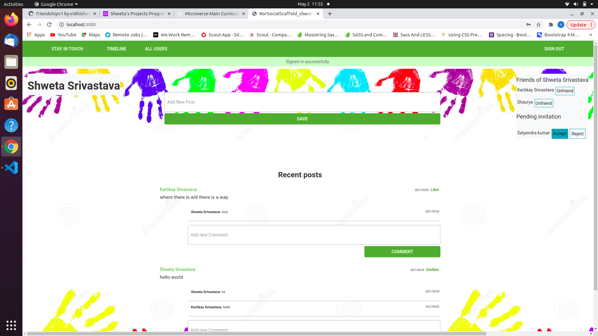
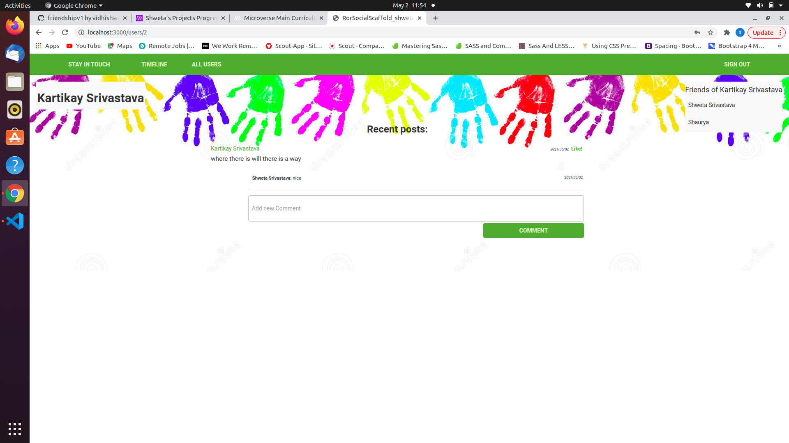
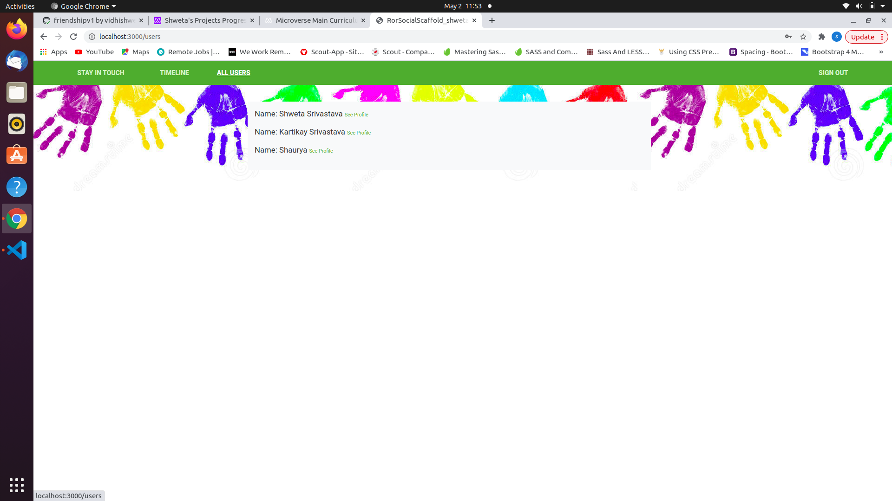
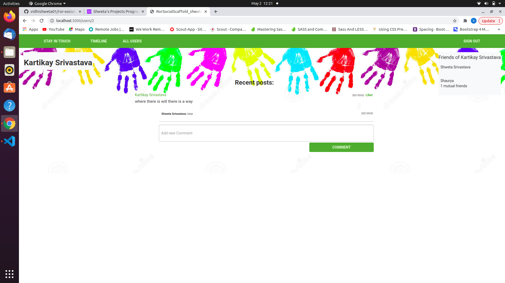
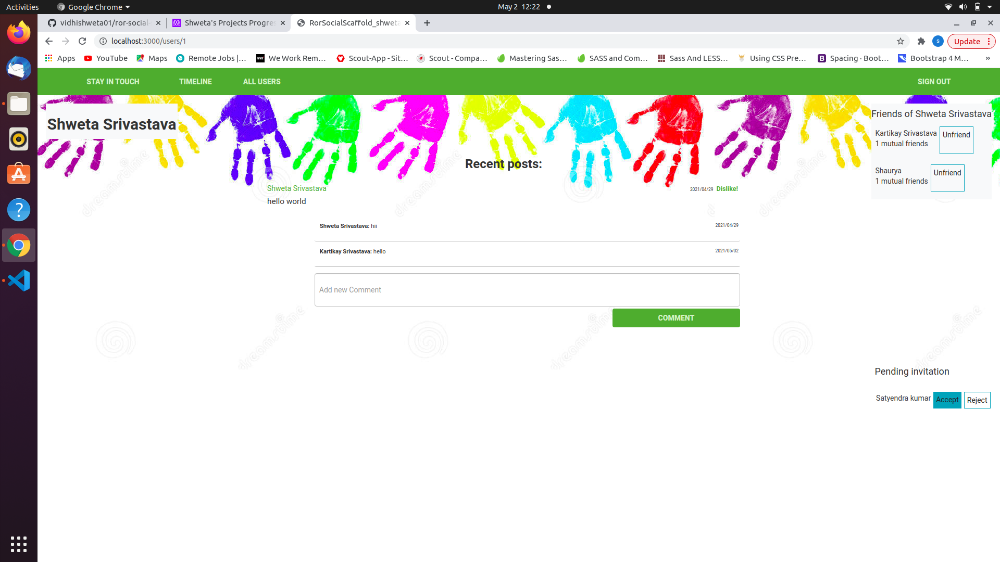

# Scaffold for social media app with Ruby on Rails













> This repo includes intial code for social media app with basic styling. Its purpose is to be a starting point for Microverse students.
created friendship app 
As a guest user:
1. able to create account/log in.
2. can see only “Sign in” and “Sign out” page.

As a logged-in user:

1. able to see all users list.
2. able to see selected user page with their user name and all posts written by them (the most recent posts on the top).
3. able to send a friendship invitation.
4. can see a button “Invite to friendship” next to the name of user who is not my friend yet - on both users’ list and single user page.
5. able to see pending friendship invitations sent to me from other users.
6. able to accept or reject friendships invitation.
7. able to create new posts (text only).
8. able to like/dislike posts (but I can like single post only once).
9. able to add comments to posts.
10. able to see “Timeline” page with posts (with number of likes and comments) written by me and all my friends (the most recent posts on the top).
11. Timeline page should be the root page of the app.

generated invitation model, added invitaion methods in Invitation.rb, changed view, added controller for invitation model, added controller for user. 
added mutual friends method in user_helper


## Built With

- Ruby v2.7.0
- Ruby on Rails v5.2.4

## Live Demo

TBA


## Getting Started

To get a local copy up and running follow these simple example steps.

### Prerequisites

Ruby: 2.6.3
Rails: 5.2.3
Postgres: >=9.5

### Setup

Instal gems with:

```
bundle install
```

Setup database with:

```
   rails db:create
   rails db:migrate
```

### Github Actions

To make sure the linters' checks using Github Actions work properly, you should follow the next steps:

1. On your recently forked repo, enable the GitHub Actions in the Actions tab.
2. Create the `feature/branch` and push.
3. Start working on your milestone as usual.
4. Open a PR from the `feature/branch` when your work is done.


### Usage

Start server with:

```
    rails server
```

Open `http://localhost:3000/` in your browser.

### Run tests

```
    rpsec --format documentation
```

> Tests will be added by Microverse students. There are no tests for initial features in order to make sure that students write all tests from scratch.

### Deployment

TBA

## Authors

TBA

## 🤝 Contributing

Contributions, issues and feature requests are welcome!

Feel free to check the [issues page](issues/).

## Show your support

Give a ⭐️ if you like this project!

## Acknowledgments

TBA

## 📝 License

TBA

